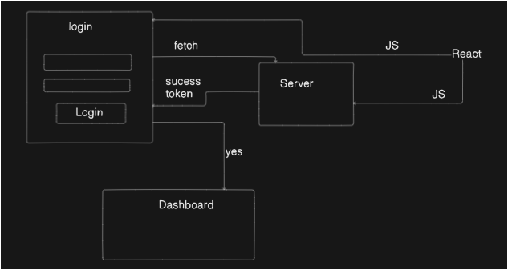
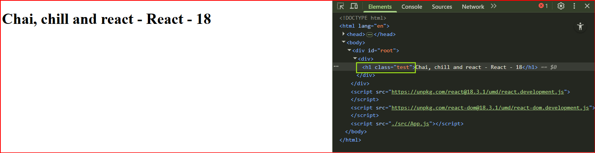
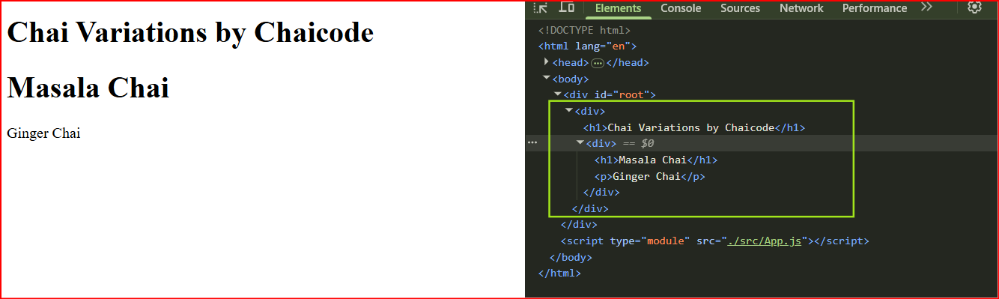
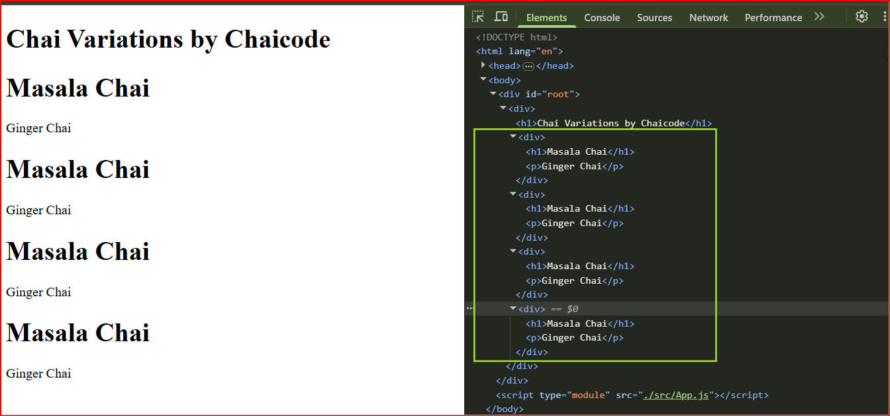

# 45 - React from scratch - Part 1
[Date : 17-05-25] - [Timeline : 01:22:00 min]

### What we learn?
- [x] React Framework Basic

<br>

### Working understanding part (only)

#### React Installation (Vite)
- 1] npm create vite@latest
- 2] cd vite-project
- 3] npm install
- 4] npm run dev

#### What is in `node modules`?
- In node modules are `dependencies` OR `JavaScript files`.


> [!NOTE]
> - whenever node modules are missing `npm run dev` not in working. 
> - i.e. JS files are missing then install node modules through `npm install`
> - dependencies as well as devDependencies are importants file in --> 'package.json'

<br>

#### Working of react

- Are we writing a React? In --> `src/App.jsx`
```jsx
function App() {
  return (
    <div>
      <h1>Chai aur react</h1>
    </div>
  );
}

export default App;
```
- Not react, It's simply its a function with exporting.
- 1] After `export default App`in `App.jsx` in that --> `main.jsx` they can import using `import App from './App.jsx'` in that.

- [x] Where from get `root`?
```jsx
createRoot(document.getElementById('root'))
```
- 2] It say come with element `document.getElementById` & root is came from --> `index.html`
```html
<div id="root"></div>
```
- There "div root reference" are used by `main.jsx`.
- 3] They say, "that root hold &render" it render method are came from react. 
- & load that `<App />` in that.
```jsx

```
createRoot(document.getElementById('root')).render(
  <StrictMode>
    <App />
  </StrictMode>,
)
---

<br>

#### React Working summery -
- 1] We have with "Blank HTML" file. i.e. `index.html`
- 2] In that, our script "main.jsx" run in that -
	- `<script type="module" src="/src/main.jsx"></script>`
- 3] `main.jsx` that load method or function i.e. `<App />` in `App.jsx`.
- 4] In `App.jsx` that function return `classic html`


- [x] `Above only working testing`.


----

<br>


## REACT Chapter - 1 : Ways of React work

- We writing javascript in 2 end ways :
	- 1] Classic : `node_modules` with using npm installing.
	- 2] CDN : `Content Delivery Network` that store in server & it can directly load.

#### Login form Example

<br>
- Our login form goes to -> Server.
- Can we send form infromation send(simple Html,CSS,JS) to server?
	- Using Fetch calling (that send data also)
- Fetch call with response `sucess` & with `token`.
- That token we can possible to store in global variable or in local storage?
	- We can store in `session, local store, globa variable, cookie`.
- If-else token is came or not that condition based we can showing `Dashboard` page? 
	Yes.
- Else token are not came then also showing `Error Message` in login page also.
- That for all over process `classic fetch is more than enough` that session, cookies or other global file for that store all information. We need REACT in process of login?
	- NO React required.

- [x] Netflix using classic way?
- In todays world also shift website in that way. 'Netflix still uses almost this'.
- But, problem is fetch method, many calls, data handing are big work for handling.
	- Neflix use that same classic way method.
- Netflix say all over run on javascript.. In that case, netflix h've many js server but, which from js min server call them that for still use a `Node`.
- `Node base application` that can continously make request from different server. becz, `Node is insanely fast for sending the web request`.

### Browser & REACT
-[x] Browser can understand REACT or Server can understand REACT?
	- NO. Not understand REACT.
- End of the day, react can convert into in `JavaScript`(frontend browser as well as backend server known JS).


### React is `Framework` or `Library`?
- Framework & Library majorly differnce -
	- Framework : That have own `Strict rules`.
	- Library : Have not any rules. 

- [x] In React 
	- UI can't change(only react way we can change UI)
	- we can use usestate or useEffect, then why its called `Library`?
	- But, React is standalone (no any routing in react) we can add routing library like react router dom...


> [!IMPORTANT]
> - Todays, React can only `thought process` its neither Library, neither framework.
> - Its more become `thought process` bcz, React/Javascript end of the day goes to browser.


#### React/Javascript Browser & Server

<br>
- End of the day all over source code came in server or going from server.
- Our small browser say give me HTML page to -> server (chaicode.com). We have 2 options -
	- 1] JS : we send all over javascript to browser
		- Browser say, only `give root in div i.e. id`
		- And javascript take over that, & `all over components can make javascript through javascript` like button, sliders, login form & activity on button clicking...
		- We send that JS bundle size is also big, `that give user seamless experience`.
	- 2] Execute JS on Server : Execute JS on server & that make page like html/css/js.
		- That can pages "html/css/js" we shift directly to browser.
		- Execute on server becz, server is powerful.
		- More time to execute "html/css/js" in server & after it paint in browser.
		- That help to minimize the load of JS(minimum load only when click on button fetch request).
		- SEO persepective.
- That have with features as well as drawbacks.

- [x] In that phase we have differnt teams working -
- Some of JS on `Client side`
- Some `Server side` 
- Split JS/html/css into small part & send it.

> [!NOTE]
> - `React is library` as in interview perspective.
> - `Alone react, doesn't do anything`.
> - `React is library` which can only help for writing javascript.


### Client Side though process
- React 1st introduce in `Client side`.
- [x] All we shift in browser site & execution.

#### Browser talk
- Browser gives `API for talking with local storage`. i.e. `onClick` function or event.
- Why `onClick` is called as API(its not json format)?
- API : is only interface only for talk.
- i.e. We have site no react only `API` function or event.
- For local storage talk browser gives that APIs.


> [!IMPORTANT]
> - Advance precaution
	> - When we learn react important thing that `Don't hunt Hooks`.
	> - You can go with hunt hooks `we never learn react`.
	> - Hooks are unlimited

----

<br>


## REACT Chapter - 2 : React in Classic Way
- We can create -> `index.html`
```html
<!DOCTYPE html>
<html lang="en">
<head>
	<meta charset="UTF-8">
	<meta name="viewport" content="width=device-width, initial-scale=1.0">
	<title>Cohort aur react</title>
</head>
<body>
	<div id="root">this is classic root div</div>
</body>
</html>
```
- Check index.html -> `npx serve` 

#### 1] CDN : [UNPKG](https://www.unpkg.com/)

- [x] React - version 18.3.1
UNPKG -> click on -> `unpkg.com/react/` -> select version (start at 18.3.1) -> click on -> react/umd/`react.development.js` -> view raws -> `Copy URL`
`https://unpkg.com/react@18.3.1/umd/react.development.js`


- [x] Core react
- react-dom : `Document Object Model` that run on browser we work on react DOM.
  - react-native : That work on mobile devices.
	- Other also available in VR, three.js...
- Core foundation is react is big library

- [x] React-Dom - version 18.3.1
- Simple change react to -> react-dom (i.e. very consistent code)
`https://unpkg.com/react@18.3.1/umd/react.development.js`


- [x] All JS functions & methods where to available -> In view raw
- e.g `function createElement(type, config, children)` where to find that function?
	- Its find in `react script`

- Make App.js in -> `src/App.js`
- In `index.html` we write dom & grab 'root' in App arrow function & it hold in container
```js
const container = document.getElementById("root")
```

- In inside App it return from React that import also & createElement find that method.
- That have with 3 properties - type, config, children
	- type - have div,paragraph,heading...
	- config - have any idea i.e {}
	- children - have copy parent property
```js
const App = () => {
	return  React.createElement(
		"div",
		{},
		React.createElement(
			"h1",
			{},
			"Chai, chill and react - React - 18")
	);
};
```

- [x] Also find JS functions & methods in react-dom.
- [x] React render for creating element.


> [!NOTE]
> - `ReactDOM` is react extension in browser.
> - Above Chapter - 2 its original react that also write same as engineers. i.e. True version of react.


- [x] In Inspect mode it shows h1 & div then add class in empty {}
- '{}' changing `{class : "test"}` that showing its -> attribute 
```js
const App = () => {
	return  React.createElement(
		"div",
		{},
		React.createElement(
			"h1",
			{class : "test"},
			"Chai, chill and react - React - 18")
	);
};

const container = document.getElementById("root")
const root = ReactDOM.createRoot(container)
root.render(React.createElement(App))
```

<br>

- [x] We know how to write classic react 
App.js
```js
const App = () => {
	return  React.createElement(
		"div",
		{},
		React.createElement(
			"h1",
			{},
			"Chai, chill and react - React - 18")
	);
};

const container = document.getElementById("root")
const root = ReactDOM.createRoot(container)
root.render(React.createElement(App))
```

<br>


#### 2] CDN : [esm react 19](https://esm.sh/)
- Easily find that CDN -> `https://esm.sh/react@19.1.0`
- We can only change src in `index.html` can break code?
- Change that - 
` "react": "https://esm.sh/react@19.1.0",
  "react-dom/": "https://esm.sh/react-dom@19.1.0/client"`
```html
<!DOCTYPE html>
<html lang="en">
<head>
	<meta charset="UTF-8">
	<meta name="viewport" content="width=device-width, initial-scale=1.0">
	<title>Cohort aur react</title>
</head>
<body>
	<div id="root">this is classic root div</div>
	<script src="https://esm.sh/react@19.1.0"></script>
	<script src="https://esm.sh/react-dom@19.1.0/client"></script>
	<script src="./src/App.js"></script>
</body>
</html>
```

#### Breaking the code of React v18 to v19
- React also divide into 2 parts client side & server side.
- In react v19 `client side` address in that executed in browser.
- E.g. `onClick()` where that executed?
	- That react v19 not execute in server side becz, this not any browser.
	- Its foundation part of react (don't jump direct into Next.js). 

<br>


#### How should I investigate in this changes in output whenever version changing 18 to 19?
- Inspect mode shows code present in `App.js` not known any idea about react becz, its in module.
- Import react & react-dom in -> `App.js` & also remove from in `index.html`.
- `type="module` is also missing.
`index.html`
```html
<!DOCTYPE html>
<html lang="en">
<head>
	<meta charset="UTF-8">
	<meta name="viewport" content="width=device-width, initial-scale=1.0">
	<title>Cohort aur react</title>
</head>
<body>
	<div id="root">this is classic root div</div>
	<script type="module" src="./src/App.js"></script>
</body>
</html>
```

`App.js`
```js
import React from "https://esm.sh/react@19.1.0";
import ReactDOM from "https://esm.sh/react-dom@19.1.0/client";

const App = () => {
	return  React.createElement(
		"div",
		{},
		React.createElement(
			"h1", {}, "Chai, chill and react - React - 18")
	);
};

const container = document.getElementById("root")
const root = ReactDOM.createRoot(container)
root.render(React.createElement(App))
```


#### Classic React working Summary 

- In `App.js` load javascript & it handle properly, we can use Javascript module in that.
- No any usecase of react-dom in that its only classic react -
```js
const App = () => {
	return  React.createElement(
		"div",
		{},
		React.createElement(
			"h1", {}, "Chai, chill and react - React - 18")
	);
};
```
- React gives `createElement` method & using that create 3 elements -
	- 1) Which element can we build? i.e. `div`
	- 2) What properties inside in i.e. `{}`
	- 3) Children i.e. also a single or multi array.

- Below that shows target the root inside `HTML`.
```js
const container = document.getElementById("root")
```
- React DOM is takeover that i.e. `createRoot` is create as `virtual DOM`
```js
const root = ReactDOM.createRoot(container)
```

- Instruct to root render as add in that
```js 
root.render(React.createElement(App))
```

#### React done that work behind the scene intelligently
- Every time new element came in react then its compare two elements -
	- 1) `We can remove whole code & rewrite` OR
	- 2) `Remove only some code part`
- i.e. React `Diffing algorithm`.
- E.g. Diffing best example is git that can showing only which code are changed.
- `Reconcilation in React` : All over that mechanism intelligently their engine work that is which ever part can remove i.e. Reconcilation.


> [!IMPORTANT]
> - Virtual DOM is programatic DOM i.e. control through code.


----

<br>

## REACT Chapter - 3 : Props make power

#### Guess the structure
- Make some method in `App.js` & we can guess that structure?

```js
const Chai = () => {
	return  React.createElement("div", {}, [
		React.createElement("h1", {}, "Masala Chai"),
		React.createElement("p", {}, "Ginger Chai"),
	])
}

const App = () => {
	return  React.createElement("div", {}, [
		React.createElement("h1", {}, "Chai Variations by Chaicode"),
		React.createElement(Chai)
	]);
};
```

<br>


- We can guess the structure?
```js
const Chai = () => {
	return  React.createElement("div", {}, [
		React.createElement("h1", {}, "Masala Chai"),
		React.createElement("p", {}, "Ginger Chai"),
	])
}

const App = () => {
	return  React.createElement("div", {}, [
		React.createElement("h1", {}, "Chai Variations by Chaicode"),
		React.createElement(Chai),
		React.createElement(Chai),
		React.createElement(Chai),
		React.createElement(Chai),
	]);
};
```

<br>


#### Use of props
- Make `App2.js` & we make `props` in that
- Props i.e. properties its -> `object`.
`App2.js`
```js
import React from "https://esm.sh/react@19.1.0";
import ReactDOM from "https://esm.sh/react-dom@19.1.0/client";

const Chai = (props) => {
	console.log(props);

	return  React.createElement("div", {}, [
		React.createElement("h1", {}, props.name),
		React.createElement("p", {}, props.cost),
	]);
};

const App = () => {
	return  React.createElement("div", {}, [
		React.createElement("h1", {}, "Chai Variations by Chaicode"),
		React.createElement(Chai, {
			name: "Masala Chai",
			cost: "1000",
		}),
		React.createElement(Chai, {
			name: "Ginger Chai",
			cost: "1000",
		}),
		React.createElement(Chai, {
			name: "Lemon Tea",
			cost: "1000",
		}),
		React.createElement(Chai, {
			name: "Ice Tea",
			cost: "1000",
		}),
	]);
};

const container = document.getElementById("root")
const root = ReactDOM.createRoot(container)
root.render(React.createElement(App))
```
- What just happen in that?
- We can make `generic component` in react language (or function) -
```js
const Chai = (props) => {
	console.log(props);

	return  React.createElement("div", {}, [
		React.createElement("h1", {}, props.name),
		React.createElement("p", {}, props.cost),
	]);
};
```
- `That components are resuable` after implementing props in that.
- `Props` make any component that are resuable, it give main power to component, for make dynamic component using props. 


----

<br>

## REACT Chapter - 4 : React useful for team work
- Install pacakges -> `npm init -y`
- Install prettier for auto completed,spaces,semicolon... -> `npm install --save-dev prettier`
- In that `devDependencies` are not goes to production that used for self.
- `.prettierrc` in that for just beautification, that file we can use for in our project -> `touch .prettierrc`.
- `.prettierignore` that for do not touch anythin in that of files -> `touch .prettierignore`
- Write script for prettier run for all that files in -> `package.json`.
- script prettier format of all files.
```json
  "scripts": {
    "format": "prettier --write \"src/**/*.{js,jsx,ts,tsx,json,css,html}\""
	},
```

----

<br>

## REACT Chapter - 5 : 


> [!NOTE]
> - 

<br> 

> [!IMPORTANT]
> - 

<br>

> [!TIP]
> -

<br>

---

### What we learn next time?
- [x] 


### Project Ideas 
- [x] 


### Things to do
- [x] In S/W industry accept opinions.
- [x] Less information, less problem (in case of `Don't hunt Hooks`).
- [x] Try to run `brain.exe`
- [x] Consistent code is very appreciated.
- [x] How to write in `.prettierrc` learn doc.


### Doubt
- [x] In `node_modules` some likes react,cjs, react compilers.. where from they are come? 
- [x] In `node_modules` all aslo replaced with `classic JavaScript using their CDNs`?
	- Yes, Its working.
- [x] We are successfully load bootstrap ? (npm not installed in that)
	- Yes.
- [x] Alone react, doesn't do anything.
- [x] `React v19 is not execute in server side` bcz, this side no any browser.
	- That is problem of next.js developer without React learning.
- [x] Investigate in JS using inspect Console & Network tab.
- [x] Dum components v/s Components in REACT.
	- Dum means its can get same output always.
- [x] `{}` -> that for attribute/property
	- Attribute is not only css class or id also other thing in that.
